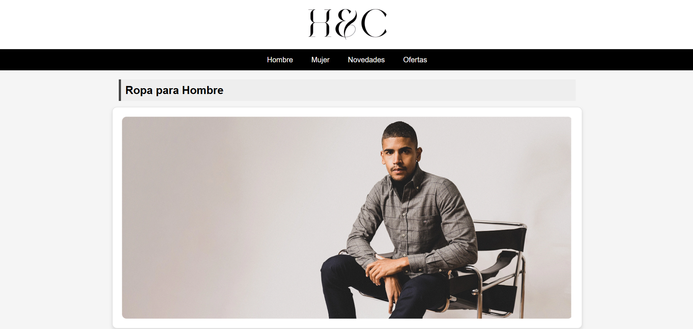
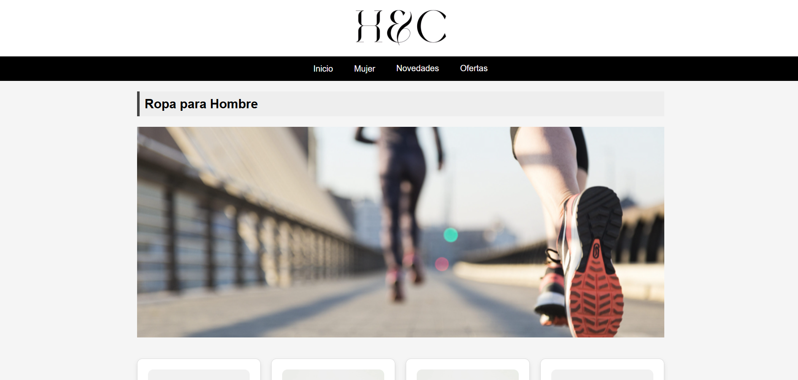
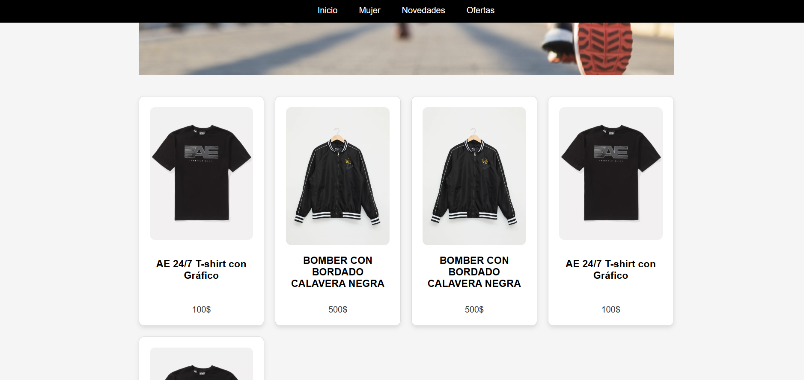
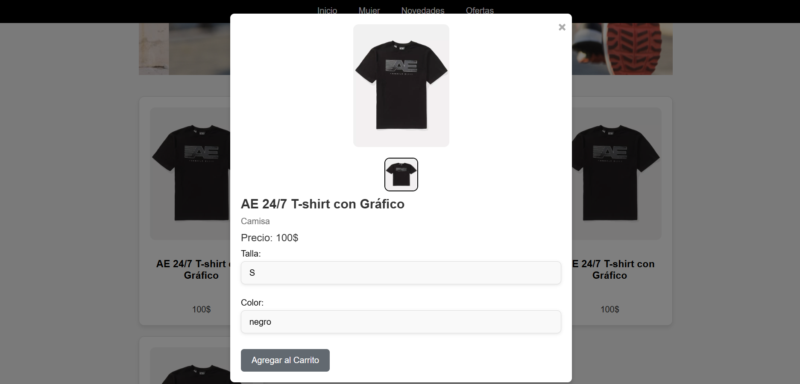

# H&C TIENDA DE ROPA

H&C TIENDA DE ROPA es una plataforma de comercio electrónico donde los usuarios pueden explorar y comprar ropa de moda. La tienda está diseñada con un estilo similar al de H&M, utilizando HTML, CSS y JavaScript para crear una experiencia de usuario atractiva y funcional.

## Descripción

Este proyecto es una tienda en línea que permite a los usuarios:

- Explorar diferentes categorías de ropa.
- Ver productos destacados en un carrusel de imágenes.
- Añadir productos al carrito de compras.
- Proceder al proceso de compra.

El proyecto está organizado de la siguiente manera:

- `index.html`: La página principal que contiene el carrusel de imágenes y los productos destacados.
- `styles.css`: La hoja de estilos para toda la tienda.
- `scripts.js`: Los scripts de JavaScript que manejan la funcionalidad del carrusel y otras interacciones.
- `images/`:imágenes utilizadas en la tienda.

## Instalación

Sigue estos pasos para configurar el proyecto localmente:

1. **Clona el repositorio**:
    ```sh
    git clone https://github.com/HectorinoS/TIENDA-DE-ROPA.git
    ```

2. **Navega al directorio del proyecto**:
    ```sh
    cd TIENDA-DE-ROPA
    ```

3. **Abre el archivo `index.html`** en tu navegador para ver la página.

## Uso

Para utilizar la tienda, sigue estos pasos:

1. **Explora la página principal**: Navega por los productos destacados y utiliza el carrusel de imágenes para ver diferentes productos.
2. **Navega por las categorías**: Usa el menú de navegación para explorar las diferentes categorías de ropa.
3. **Añade productos al carrito**: Haz clic en el botón "Añadir al carrito" en la página de detalles del producto.

## Estructura del Proyecto

- **index.html**: Contiene la estructura principal de la página y el carrusel de imágenes.
- **styles.css**: Incluye todos los estilos CSS utilizados en la tienda.
- **scripts.js**: Maneja la lógica del carrusel de imágenes y otras interacciones de usuario.
- **images/**: imágenes de productos y banners.

## Contribución

Si deseas contribuir a este proyecto, por favor sigue estos pasos:

1. **Haz un fork del proyecto**.
2. **Crea una nueva rama** (feature/nueva-caracteristica):
    ```sh
    git checkout -b feature/nueva-caracteristica
    ```
3. **Realiza los cambios** y confirma tus commits:
    ```sh
    git commit -m "Agregar nueva característica"
    ```
4. **Envía una solicitud de pull (Pull Request)**: Explica los cambios realizados y por qué deberían ser fusionados.


## Contacto

Para cualquier consulta, puedes contactarnos en (terracraftelcrack@gmail.com).

## Capturas de Pantalla

A continuación se presentan algunas capturas de pantalla de la tienda:



![Captura de Pantalla ] (CAPTURA 1.png)








## Créditos

Este proyecto fue desarrollado por [Hector FlamintHot/Citlalli Z] como parte de un proyecto personal/educativo. Agradecimientos especiales a [Andres Luna (Profesor Software].

## Changelog

### v1.0.0

- Lanzamiento inicial con funcionalidades básicas de navegación y carrito de compras.
- Implementación del carrusel de imágenes en la página principal.

### Roadmap

- [ ] Implementar funcionalidad de búsqueda.
- [ ] Añadir más categorías de productos.
- [ ] Mejorar la experiencia del usuario en dispositivos móviles.
- [ ] Integrar pasarela de pago.

